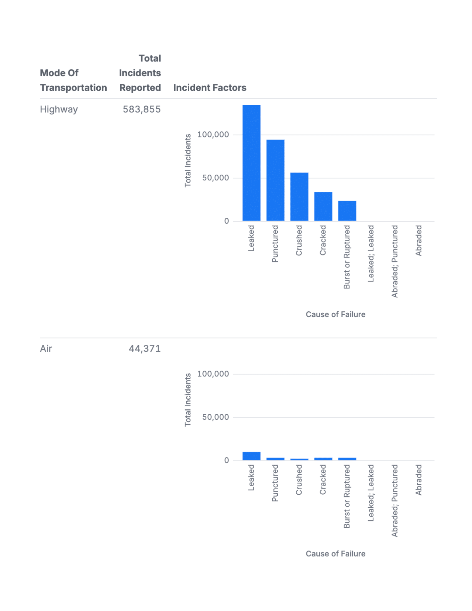

# Hazmat Transportation Incident Reports Analysis

This project aims to analyze the data from [PHMSA "5800.1" Hazmat Transportation Incident Reports](https://github.com/data-liberation-project/phmsa-hazmat-incident-reports), which was provided by the Data Liberation Project. More specifically, this project implements Malloy (a new programing language) to create visuals so that readers can more easily understand what the data is telling us.

# What Is In The Data?

"These ["5800.1" forms](https://www.phmsa.dot.gov/sites/phmsa.dot.gov/files/docs/IncidentForm010105.pdf) include details about the location of the incident, mode of transportation, parties involved, hazardous materials involved, causes of failure, fatalities, injuries, financial cost, and more.

PHSMA publishes the submitted reports [through an online portal](https://www.phmsa.dot.gov/hazmat-program-management-data-and-statistics/data-operations/incident-statistics). That portal, however, is brittle and does not provide a straightforward mechanism to download the full set of submitted reports."

- Details sourced from the Data Liberation Project's [README.md file](https://github.com/data-liberation-project/phmsa-hazmat-incident-reports/blob/main/README.md)

# What Was Done In The Analysis

Most of the queries and tables made in this analysis return simple aggregates, with some of them being grouped by various factors such as where the incident occurred, when it occurred, mode of transportation, etc. To give an example, the following is one of the last visualizations made in the analysis:

|  |

## Directions on how to use the github web editor to run the same analysis
Are you logged into github? Just press the period key right now. This will load the web editor. Then install the malloy extension. See images below for reference:
| **Step**   | **Image Preview** |
|--------|-----------|
| `Step 1 - Press allow` |  |
| `Step 2 - Click the Blocks, search for Malloy, install` |  |
| `Step 3 - Click Trust` |  |
| `Step 4 - Click a .malloynb file` |  |
| `Step 5 - Press Run` |  |
