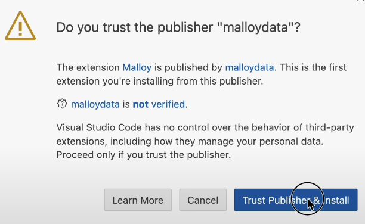

# Hazmat Transportation Incident Reports Analysis

This project aims to analyze the data from [PHMSA "5800.1" Hazmat Transportation Incident Reports](https://github.com/data-liberation-project/phmsa-hazmat-incident-reports), which was provided by the Data Liberation Project. Under §171.16, "each person in physical possession of a hazardous material at the time that any of [certain types of incidents] occurs during transportation (including loading, unloading, and temporary storage) must submit a Hazardous Materials Incident Report on DOT Form F 5800.1 [...] within 30 days of discovery of the incident". This project implements Malloy (a new programing language) to create visuals so that readers can more easily understand what the data is telling us.

# What Is In The Data?

"These ["5800.1" forms](https://www.phmsa.dot.gov/sites/phmsa.dot.gov/files/docs/IncidentForm010105.pdf) include details about the location of the incident, mode of transportation, parties involved, hazardous materials involved, causes of failure, fatalities, injuries, financial cost, and more.

PHSMA publishes the submitted reports [through an online portal](https://www.phmsa.dot.gov/hazmat-program-management-data-and-statistics/data-operations/incident-statistics). That portal, however, is brittle and does not provide a straightforward mechanism to download the full set of submitted reports."

- Details sourced from the Data Liberation Project's [README.md file](https://github.com/data-liberation-project/phmsa-hazmat-incident-reports/blob/main/README.md)

# What Was Done In The Analysis

Most of the queries and tables made in this analysis return simple aggregates, with some of them being grouped by various factors such as where the incident occurred, when it occurred, mode of transportation, etc. To give some examples, here are some of the visualizations made in the analysis:

While it is not explicitly shown in the screenshot, this graph displays the causes of failure for one of the modes of transportation. As you can see from the top few causes, you can see that physical damage of the structure containing the hazardous material is the primary cause of these incidents. The causes of these failures are most likely due to in-route accidents or faulty setup/preparations.

  

With this preview of the visualization, we can see that there is a sharp increase in incidents from 1989 to 1990. During 1990, there were several large scale incidents that occured in several states in the U.S. Some of these accidents include the disaster at Phillips Petroleum Company's chemical complex in Pasadena, Texas, the ARCO Chemical Company complex explosion in Channelview, Texas, and the Gramercy Park Asbestos Steam Explosion.

  

This chart is showing us the trend line of incidents throughout an average year. Because construction projects are typically done during the summer months, it makes sense that the majority of the incidents would happen during that time, as shown in the graph.

  

In this last preview, we can see a heat/map chart of incidents that were reported across the U.S. On the map, California, Texas, Illinois, and Ohio are among the states with the highest count of reports. California and Texas have some of the highest counts of incident reports, which can largely be attributed to their large populations and high population densities. With more people living in these states, there are naturally more opportunities for incidents to occur. Illinois and Ohio also have fairly high counts of incident reports. This is likely due to their geographical location which sees tornados and floods more frequenty. 

  

## Directions on how to use the github web editor to run the same analysis
Because of the size of the data, you first must go to the first link and download the data from the Data Liberation Project Website. Once you have downloaded the data, you should be able to import it into the Virtual Studio Code environment and press the period key to run it. This will load the web editor. Then install the malloy extension. See images below for reference:
| **Step**   | **Image Preview** |
|--------|-----------|
| `Step 1 - Press allow` |  |
| `Step 2 - Click the Blocks, search for Malloy, install` |  |
| `Step 3 - Click Trust` |  |
| `Step 4 - Click a .malloynb file` |  |
| `Step 5 - Press Run` |  |
